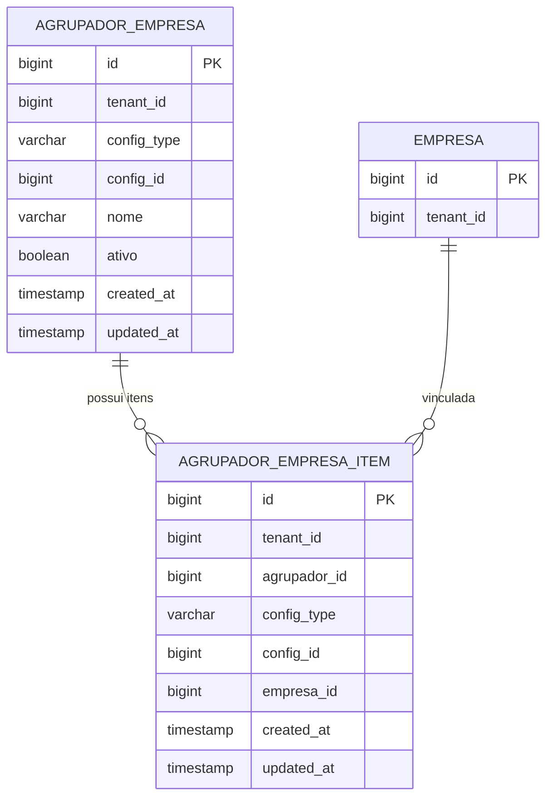

# Plano de Implementação — Agrupadores de Empresas por Configuração (Multi-tenant)

## 1) Resumo Executivo

- Objetivo: criar recurso reutilizável de “Agrupadores de Empresas” para qualquer tela de configuração, com integridade forte no backend e UX clara no frontend.
- Decisão principal de modelagem: **vínculo polimórfico** por `config_type + config_id` (Alternativa B), alinhado ao padrão já existente no projeto (`config_formulario`, `config_coluna` com escopo/identificação genérica).
- Regra crítica garantida no banco: **uma empresa só pode estar em um agrupador por configuração** via `UNIQUE (tenant_id, config_type, config_id, empresa_id)`.
- Estratégia de remoção: **hard delete** (agrupador e vínculos), liberando imediatamente empresas para reaproveitamento.
- Concorrência: `@Transactional` + constraint UNIQUE + tratamento explícito de violação para `409 Conflict`.

---

## 2) Modelagem de Domínio

## Alternativas de modelagem para “Configuração”
- **Alternativa A (entidade unificada Configuracao)**: centraliza tudo, mas exige refatoração ampla e risco alto agora.
- **Alternativa B (polimórfica `config_type + config_id`) — escolhida**: incremental, compatível com arquitetura atual, suporta embutir componente em múltiplos contextos.
- **Alternativa C (chave textual única `config_ref`)**: flexível, mas perde semântica forte e dificulta validações/filtros.

## Entidades
- `AgrupadorEmpresa`
- Campos: `id`, `tenantId`, `configType`, `configId`, `nome`, `ativo`, `createdAt`, `createdBy`, `updatedAt`, `updatedBy`
- Regra: `nome` único por configuração (case-insensitive), recomendado e adotado.

- `AgrupadorEmpresaItem` (vínculo agrupador-empresa)
- Campos: `id`, `tenantId`, `agrupadorId`, `configType`, `configId`, `empresaId`, auditoria
- Motivo de duplicar `configType/configId`: viabilizar UNIQUE crítica no nível do banco sem join.

## Regras de negócio
- Agrupador pode existir com 0 empresas: **sim**.
- Justificativa: permite cadastro incremental, evita bloquear fluxo de configuração.
- Empresa de outro tenant: proibido.
- Configuração inexistente: proibido.
- Empresa em 2 agrupadores na mesma configuração: proibido (constraint e validação).

---

## 3) Banco de Dados (Flyway) e Constraints

## Migração proposta
- Novo script: `V7__agrupador_empresa_por_configuracao.sql`

## Tabelas
- `agrupador_empresa`
- `agrupador_empresa_item`

## Constraints obrigatórias
- Isolamento tenant em todas as tabelas (`tenant_id NOT NULL` + índices compostos).
- FK de item para agrupador com consistência de config:
- `FOREIGN KEY (tenant_id, agrupador_id, config_type, config_id) -> agrupador_empresa (tenant_id, id, config_type, config_id)`
- FK de item para empresa no mesmo tenant:
- `FOREIGN KEY (tenant_id, empresa_id) -> empresa (tenant_id, id)`
- Constraint crítica:
- `UNIQUE (tenant_id, config_type, config_id, empresa_id)` em `agrupador_empresa_item`
- Nome único por configuração:
- `UNIQUE INDEX ux_agrupador_nome_cfg_ci ON agrupador_empresa (tenant_id, config_type, config_id, lower(nome))`

## Índices de performance
- `idx_agrupador_cfg` em `(tenant_id, config_type, config_id, ativo)`
- `idx_item_agrupador` em `(tenant_id, agrupador_id)`
- `idx_item_cfg_empresa` em `(tenant_id, config_type, config_id, empresa_id)` (além do UNIQUE)
- `idx_item_empresa` em `(tenant_id, empresa_id)` para lookup de “empresa já vinculada?”

## Observação técnica importante
- Para FK `(tenant_id, empresa_id)` funcionar, garantir índice único em `empresa(tenant_id, id)` (adicionar se inexistente).
- Para FK composta com agrupador funcionar, criar unique auxiliar em `agrupador_empresa(tenant_id, id, config_type, config_id)`.

## Estratégia incremental
- Criar novas tabelas e índices sem alterar fluxos existentes.
- Nenhum backfill necessário.
- Deploy seguro com feature desligada no frontend até backend estável.

---

## 4) Backend Spring Boot (Java 21)

## Pacotes sugeridos
- `domain`: `AgrupadorEmpresa`, `AgrupadorEmpresaItem`
- `repository`: `AgrupadorEmpresaRepository`, `AgrupadorEmpresaItemRepository`
- `dto`: request/response para agrupador e itens
- `service`: `AgrupadorEmpresaService`, `ConfiguracaoRefService` (validação de referência)
- `web`: `AgrupadorEmpresaController`

## API REST genérica
- `GET /api/configuracoes/{configType}/{configId}/agrupadores-empresa`
- `GET /api/configuracoes/{configType}/{configId}/agrupadores-empresa/{agrupadorId}`
- `POST /api/configuracoes/{configType}/{configId}/agrupadores-empresa`
- `PATCH /api/configuracoes/{configType}/{configId}/agrupadores-empresa/{agrupadorId}`
- `POST /api/configuracoes/{configType}/{configId}/agrupadores-empresa/{agrupadorId}/empresas`
- `DELETE /api/configuracoes/{configType}/{configId}/agrupadores-empresa/{agrupadorId}/empresas/{empresaId}`
- `DELETE /api/configuracoes/{configType}/{configId}/agrupadores-empresa/{agrupadorId}`

## Exemplos JSON
```json
POST /api/configuracoes/PRODUTO/42/agrupadores-empresa
{
  "nome": "Grupo Norte"
}
```

```json
POST /api/configuracoes/PRODUTO/42/agrupadores-empresa/10/empresas
{
  "empresaId": 2
}
```

```json
GET /api/configuracoes/PRODUTO/42/agrupadores-empresa
{
  "content": [
    {
      "id": 10,
      "nome": "Grupo Norte",
      "ativo": true,
      "empresas": [
        { "id": 2, "razaoSocial": "Filial Zeta", "cnpj": "..." }
      ]
    }
  ]
}
```

## Validações e erros
- Bean Validation: `nome` obrigatório, tamanho, `empresaId` obrigatório.
- Erros padronizados com códigos de negócio:
- `agrupador_empresa_nome_duplicado` -> 409
- `agrupador_empresa_empresa_duplicada_config` -> 409
- `agrupador_empresa_not_found` -> 404
- `configuracao_not_found` -> 404
- `empresa_not_found` / `empresa_tenant_invalido` -> 400/404
- Em `ApiExceptionHandler`, adicionar tratamento de `DataIntegrityViolationException` com leitura de constraint name para mensagem clara.

## Segurança multi-tenant
- Reuso do `TenantAccessFilter` atual (`X-Tenant-Id`).
- Em service: validar tenant corrente (`TenantContext`) em todas as operações.
- Validar que configuração e empresas pertencem ao mesmo tenant (via `ConfiguracaoRefService` + consulta de empresa por tenant).

## Concorrência (obrigatório)
- Método de vincular empresa ao agrupador:
- `@Transactional`
- Tenta inserir `AgrupadorEmpresaItem`.
- Se `DataIntegrityViolationException` da unique de empresa por configuração, retornar 409:
- “Esta empresa já está vinculada a outro agrupador nesta configuração”.

---

## 5) Frontend Angular — Componente Reutilizável

## Componente
- `app-agrupadores-empresa`
- Inputs:
- `[configType]: string`
- `[configId]: number`
- `[readonly]?: boolean`
- Output opcional:
- `(changed)` para integração com telas hospedeiras.

## Estrutura
- `agrupadores-empresa.component.ts/html/css` (standalone, padrão do projeto)
- `agrupadores-empresa.service.ts` para API
- Reuso de componentes já existentes para filtros/busca (`FieldSearchComponent`, loaders, notification service).

## UX mínima
- Lista de agrupadores da configuração.
- Criar, renomear, excluir agrupador.
- Gerenciar empresas vinculadas.
- Multi-seleção com busca e paginação/lazy load de empresas do tenant.
- Bloqueio preventivo no UI: empresas já vinculadas aparecem desabilitadas com indicação do agrupador atual.
- Fallback obrigatório: tratar erro 409/422 da API com mensagem clara.

## Estados
- Loading inicial
- Loading por ação (add/remove/save/delete)
- Estado vazio
- Estado erro com retry

---

## 6) Testes

## Backend unit/integration
- `AgrupadorEmpresaServiceTest`:
- criação/renomeação/exclusão
- validações de tenant/config/empresa
- `AgrupadorEmpresaRepositoryIT`:
- validação de constraints (`UNIQUE` nome, `UNIQUE` empresa por config)
- `AgrupadorEmpresaConcurrencyIT`:
- 2 threads tentando vincular mesma empresa em agrupadores diferentes (mesmo config):
- esperado: 1 sucesso + 1 conflito 409

## Frontend
- Unit tests do componente:
- renderização, create/edit/delete, add/remove empresas
- tratamento de erro 409
- E2E:
- criar 2 agrupadores na mesma configuração
- tentar mesma empresa nos 2
- esperado: bloqueio UI ou erro claro API e integridade mantida

## Casos de borda obrigatórios
- empresa de outro tenant
- configuração inexistente
- exclusão de agrupador e reaproveitamento da empresa em outro agrupador
- agrupador com 0 empresas

---

## 7) Diagrama (Mermaid)



---

## 8) Riscos e Mitigações

- Race condition de vínculo duplicado:
- Mitigação: UNIQUE no banco + transação + tratamento 409.
- Performance com muitas empresas:
- Mitigação: índices compostos + paginação/lazy-load.
- Configuração polimórfica inválida:
- Mitigação: `ConfiguracaoRefService` por `configType` com validação explícita.
- UX de concorrência:
- Mitigação: lock visual por item em operação + mensagem clara de conflito.

---

## 9) Plano de Entrega por Etapas (com DoD e rollback)

## Etapa 1 — Base funcional
- Checklist:
- [ ] Flyway `V7` com tabelas, FKs, índices e UNIQUE obrigatória
- [ ] Entidades/repositórios/services/controllers backend
- [ ] Componente Angular básico embutível por `configType/configId`
- [ ] Fluxos CRUD de agrupador e add/remove empresa
- [ ] Tratamento 409 para vínculo duplicado
- DoD:
- API funcional + integração frontend sem workaround.
- Rollback:
- Feature flag frontend desligada; endpoints não expostos em menu.
- Migração permanece sem uso.

## Etapa 2 — UX refinada + E2E
- Checklist:
- [ ] Multi-select com busca e paginação
- [ ] Exibir “empresa já vinculada no agrupador X”
- [ ] Mensagens de erro/feedback padronizadas
- [ ] Testes E2E de cenário completo
- DoD:
- Não requer refresh manual e feedback instantâneo de conflito.
- Rollback:
- voltar para versão básica do componente mantendo backend.

## Etapa 3 — Hardening
- Checklist:
- [ ] Auditoria detalhada por evento
- [ ] Métricas/logs operacionais
- [ ] Testes de concorrência em pipeline
- [ ] Revisão de permissões por configType
- DoD:
- estabilidade em concorrência e observabilidade adequada.
- Rollback:
- desativar somente recursos de observabilidade/UX avançada.

---

## 10) Critérios de Aceite (fechados)

- [ ] Em qualquer tela de configuração, o componente permite criar/editar/remover agrupadores.
- [ ] Empresas vinculadas sempre pertencem ao tenant corrente.
- [ ] Dentro da mesma configuração, mesma empresa nunca fica em dois agrupadores.
- [ ] Em concorrência, uma operação vence e outra falha com 409/422 e mensagem clara.
- [ ] Testes unitários, integração, concorrência e E2E passando.
- [ ] Entrega incremental com Flyway e sem quebra do sistema existente.

---

## 11) Assumptions e Defaults adotados

- `configId` será `BIGINT`.
- `configType` será `VARCHAR(50)` com valores controlados em enum no backend.
- `nome` de agrupador será único por configuração (case-insensitive).
- Remoção será **hard delete** nesta entrega.
- Permissão mínima de operação: `CONFIG_EDITOR` (listar pode exigir `RELATORIO_VIEW` para empresas).
- Padrão de API de erro seguirá `ProblemDetail` e códigos de domínio em `detail`.
