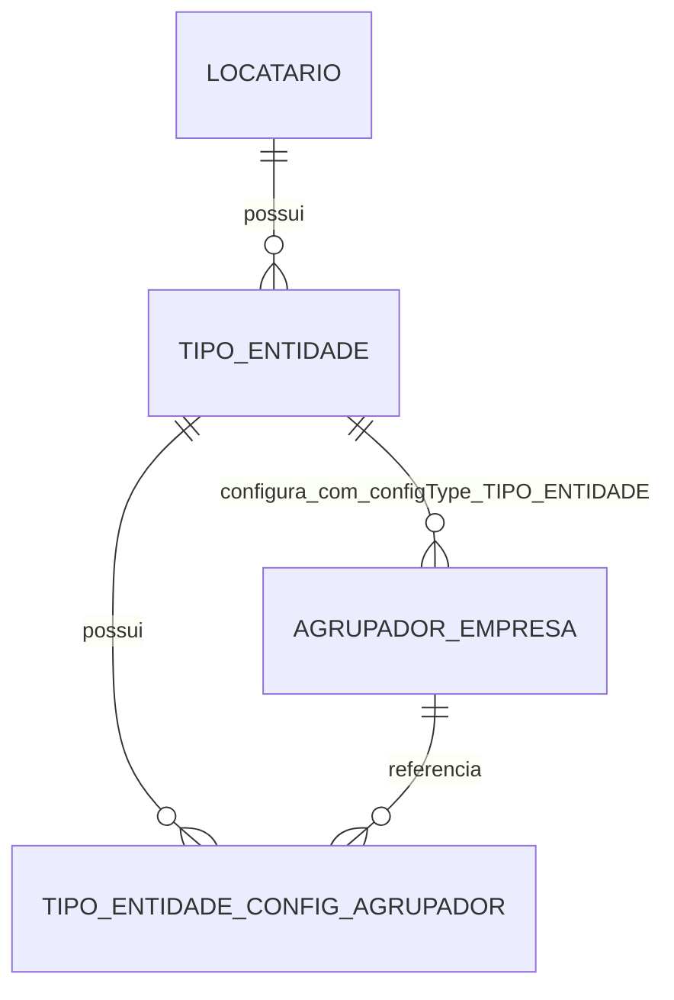

# tipo-entidade-modulo-feature

## Contexto
- Sistema multi-tenant com isolamento por `tenantId` em todas as entidades e operacoes.
- Ja existe o componente e backend de `Agrupadores de Empresas por Configuracao` com escopo polimorfico (`configType` + `configId`).
- O novo modulo deve seguir os mesmos padroes de arquitetura, endpoints, erros, seguranca e organizacao Angular ja adotados no projeto.

## Objetivo
- Implementar o modulo `Tipos de Entidade` com CRUD por locatario, seed automatico de tipos padrao no cadastro de locatario e integracao com agrupadores.
- Implementar configuracao por agrupador para cada tipo de entidade, iniciando com o campo `obrigarUmTelefone`.

## Escopo
- Inclui:
- CRUD completo de `TipoEntidade` (com exclusao soft para customizados).
- Seed automatico de `CLIENTE`, `FORNECEDOR`, `EQUIPE` por tenant.
- Integracao da ficha de tipo com `<app-agrupadores-empresa [configType]="'TIPO_ENTIDADE'" [configId]="tipoEntidade.id">`.
- Nova tabela de configuracao por agrupador: `tipo_entidade_config_agrupador`.
- Endpoints para editar `obrigarUmTelefone` por `tipoEntidadeId + agrupadorId`.
- Testes unitarios, integracao, concorrencia e E2E.
- Nao inclui:
- Cadastros de clientes/fornecedores/equipe em si.

## Passos acordados

### 1) Modelagem de dominio
- Criar entidade `TipoEntidade`:
- `id`, `tenantId`, `nome`, `codigoSeed`, `tipoPadrao`, `ativo`, auditoria.
- Criar entidade `TipoEntidadeConfigPorAgrupador`:
- `id`, `tenantId`, `tipoEntidadeId`, `agrupadorId`, `obrigarUmTelefone`, `ativo`, auditoria.
- Cardinalidades:
- `Locatario 1..N TipoEntidade`.
- `TipoEntidade 1..N TipoEntidadeConfigPorAgrupador`.
- `TipoEntidadeConfigPorAgrupador N..1 AgrupadorEmpresa`.
- Regra dos padroes semeados:
- nao excluiveis;
- `codigoSeed` imutavel;
- `tipoPadrao` imutavel;
- renomeacao permitida somente se nao quebrar unicidade.

### 2) Banco de dados e migracao
- Criar migration `V8__tipo_entidade_e_config_por_agrupador.sql`.
- Tabela `tipo_entidade`:
- `UNIQUE (tenant_id, codigo_seed)` para seeds (quando nao nulo);
- `UNIQUE` de nome ativo por tenant;
- indice por tenant/ativo.
- Tabela `tipo_entidade_config_agrupador`:
- `UNIQUE (tenant_id, tipo_entidade_id, agrupador_id, ativo)`;
- FK para `tipo_entidade` com tenant;
- FK para `agrupador_empresa` com tenant;
- indices por tipo e por agrupador.
- Estrategia: migration incremental aditiva, sem quebra de compatibilidade.

### 3) Seed automatico no cadastro de locatario
- Criar `TipoEntidadeSeedService` e chamar em `LocatarioService.create(...)` apos os seeds existentes.
- Criar seeds: `CLIENTE`, `FORNECEDOR`, `EQUIPE` com `tipoPadrao=true` e `codigoSeed` correspondente.
- Garantir idempotencia por consulta previa + unique de banco.
- Em conflito concorrente de insert, capturar excecao de integridade e reler registro.

### 4) Backend Spring Boot
- Criar repositorios:
- `TipoEntidadeRepository`;
- `TipoEntidadeConfigPorAgrupadorRepository`.
- Criar servicos:
- `TipoEntidadeService` (CRUD e regras de exclusao);
- `TipoEntidadeConfigAgrupadorService` (config por agrupador);
- `TipoEntidadeConfigAgrupadorSyncService` (sync com ciclo de vida de agrupadores).
- Criar controller `TipoEntidadeController` com endpoints:
- `GET /api/tipos-entidade` (paginado);
- `GET /api/tipos-entidade/{id}`;
- `POST /api/tipos-entidade`;
- `PUT /api/tipos-entidade/{id}`;
- `DELETE /api/tipos-entidade/{id}` (soft delete, bloqueio de semeados);
- `GET /api/tipos-entidade/{id}/config-agrupadores`;
- `PUT /api/tipos-entidade/{id}/config-agrupadores/{agrupadorId}`.
- Integrar com agrupadores:
- adicionar `TIPO_ENTIDADE` em `ConfiguracaoScopeService`;
- ao criar agrupador de tipo entidade: criar config default `obrigarUmTelefone=false`;
- ao remover agrupador: desativar/remover config correspondente.
- Atualizar `ApiExceptionHandler` com novos codigos e mensagens amigaveis (`409` para conflitos de integridade).

### 5) Frontend Angular
- Criar feature `frontend/src/app/features/entity-types/`:
- `entity-types-list.component.ts/.html/.css`;
- `entity-type-form.component.ts/.html/.css`;
- `entity-type.service.ts`;
- `entity-type-config-by-group.service.ts`.
- Adicionar rotas:
- `/entity-types`, `/entity-types/new`, `/entity-types/:id`, `/entity-types/:id/edit`.
- Na ficha de tipo:
- secao `Agrupadores de Empresas` usando componente reutilizavel existente;
- secao `Configuracoes por Agrupador` com toggle `ObrigarUmTelefone` por agrupador.
- UX:
- badge `Padrao do Sistema` para semeados;
- botao excluir desabilitado para `tipoPadrao=true`;
- estados `loading/erro/vazio/salvando` com `NotificationService`.

### 6) Concorrencia e integridade
- Seed idempotente protegido por constraint.
- Config por agrupador protegida por unique de banco.
- Operacoes de criacao/atualizacao em `@Transactional`.
- Em violacao de unique, retornar `409 Conflict` com mensagem clara.

### 7) Testes
- Unitarios backend:
- CRUD e regras de bloqueio dos semeados;
- seed idempotente.
- Integracao backend:
- endpoints + constraints + multi-tenant.
- Concorrencia backend:
- duas requisicoes para mesma config por agrupador; esperado `1 sucesso + 1 conflito`.
- Frontend unitarios:
- listagem/form, desabilitacao de exclusao de semeados, toggle de configuracao por agrupador.
- E2E:
- CRUD tipo customizado;
- semeados nao excluiveis;
- integracao com agrupadores;
- edicao de `obrigarUmTelefone`.

### 8) Entrega por etapas
- Etapa 1: DB + CRUD + seed.
- Etapa 2: integracao do componente de agrupadores na ficha.
- Etapa 3: config por agrupador (`obrigarUmTelefone`) backend + UI.
- Etapa 4: hardening (auditoria, permissoes, concorrencia, performance, testes finais).

## Critérios de conclusao
- Ao criar locatario, existem `CLIENTE`, `FORNECEDOR`, `EQUIPE` automaticamente.
- Tipos customizados podem ser criados/alterados/excluidos por locatario.
- Tipos semeados nao podem ser excluidos e retornam erro claro.
- Tela de tipo inclui secao de agrupadores (`configType=TIPO_ENTIDADE`, `configId=id`).
- Para cada agrupador do tipo existe no maximo uma configuracao ativa.
- `obrigarUmTelefone` pode ser editado e persistido por agrupador.
- Constraints garantem consistencia multi-tenant e unicidade.
- Testes unitarios/integracao/concorrencia/E2E passando.

## JSON de referencia (contratos)
```json
POST /api/tipos-entidade
{
  "nome": "PARCEIRO",
  "ativo": true
}
```

```json
PUT /api/tipos-entidade/10/config-agrupadores/88
{
  "obrigarUmTelefone": true
}
```

## Diagrama textual

