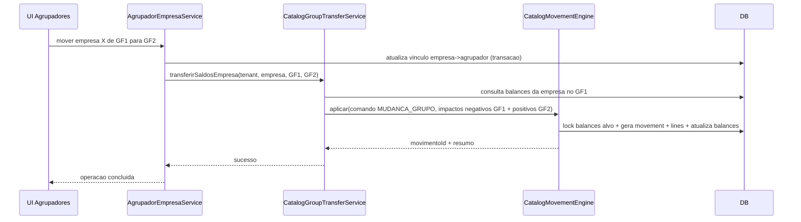
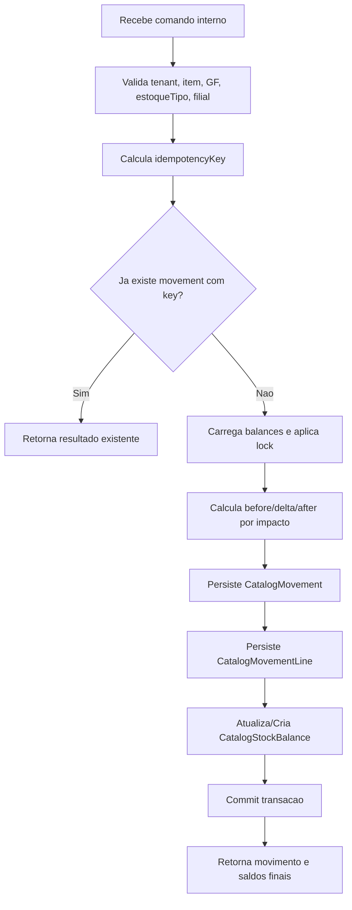

# catalogo-estoque-movimentacoes-feature

## Escopo e Nao-Escopo
### Escopo desta fase
1. Fundacao de estoque para itens de catalogo (Produtos e Servicos) com saldos atuais por `tenant + catalogo + GF + estoqueTipo + filial`.
2. Ledger unificado e imutavel para historico de alteracoes de saldo (quantidade e preco).
3. Engine unica de movimentacao no backend (`CatalogMovementEngine`) para aplicar impactos de saldo, gravar ledger e atualizar saldo.
4. Integracao com `AgrupadorEmpresaService` para transferencia automatica de saldos ao mover empresa entre agrupadores, via evento interno `MUDANCA_GRUPO`.
5. Endpoints apenas de consulta (saldos e historico), sem endpoints de criacao de movimento operacional.
6. UI Angular somente para consulta de saldos/historico por item de catalogo.

### Nao-escopo desta fase
1. Nao implementar movimento manual (entrada/saida/transferencia) via UI/API publica.
2. Nao implementar integracao com pedidos, notas, compra, venda, reserva, consignacao operacionais.
3. Nao implementar workflows fiscais/comerciais.
4. Nao alterar regras de numeracao do cadastro de produtos/servicos.

---

## Glossario
1. `GF` (Agrupador de Empresas): grupo de filiais no escopo CATALOGO.
2. `Filial`: empresa vinculada a um GF.
3. `EstoqueTipo`: categoria de saldo dentro de um GF (ex.: Estoque Geral, Consignado, Reservado), conforme estudo `plans/estudo estoque.txt`.
4. `Saldo`: valor atual persistido em `CatalogStockBalance` (quantidade e preco).
5. `Movimento` (ledger header): evento de alteracao de saldo (`CatalogMovement`).
6. `Linha de Movimento`: impacto atomico em uma combinacao de metrica/estoqueTipo/filial (`CatalogMovementLine`).
7. `Origem`: motivador do evento (`origemMovimentacaoTipo` + `origemMovimentacaoCodigo`).
8. `Metrica`: tipo de valor alterado (`QUANTIDADE`, `PRECO`).
9. `Idempotencia`: garantia de que repetir o mesmo evento nao duplica efeitos.

---

## Modelagem (Entidades, Relacoes, Chaves)

### 1. `CatalogStockType` (nova)
Objetivo: definir os tipos de estoque por GF (estoques A/B/C do estudo).

Campos sugeridos:
- `id`
- `tenantId`
- `catalogConfigurationId` (PRODUCTS/SERVICES)
- `agrupadorEmpresaId`
- `codigo` (ex.: `GERAL`, `CONSIGNADO`, `RESERVADO`)
- `nome`
- `ordem`
- `active`
- `createdAt`, `updatedAt`, `version`

Constraints/indices:
- `UNIQUE (tenant_id, catalog_configuration_id, agrupador_empresa_id, codigo, active)`
- indice por `(tenant_id, catalog_configuration_id, agrupador_empresa_id, active)`

### 2. `CatalogStockBalance` (nova)
Objetivo: leitura rapida de saldo atual.

Campos:
- `id`
- `tenantId`
- `catalogoId` (item de catalogo)
- `catalogType` (`PRODUCTS`/`SERVICES`) para evitar colisao e facilitar filtro
- `catalogConfigurationId`
- `agrupadorEmpresaId`
- `estoqueTipoId`
- `filialId`
- `quantidadeAtual DECIMAL(19,6)`
- `precoAtual DECIMAL(19,6)`
- `updatedAt`
- `version`

Constraints/indices:
- `UNIQUE (tenant_id, catalog_type, catalogo_id, agrupador_empresa_id, estoque_tipo_id, filial_id)`
- indices de consulta:
  - `(tenant_id, catalog_type, catalogo_id)`
  - `(tenant_id, catalog_configuration_id, agrupador_empresa_id, estoque_tipo_id)`

### 3. `CatalogMovement` (novo, ledger header)
Campos obrigatorios:
- `id`
- `tenantId`
- `catalogoId`
- `catalogType`
- `catalogConfigurationId`
- `agrupadorEmpresaId` (contexto do evento, imutavel)
- `origemMovimentacaoTipo` (`MUDANCA_GRUPO`, `SYSTEM`)
- `origemMovimentacaoCodigo`
- `origemMovimentoItemCodigo`
- `dataHoraMovimentacao`
- `observacao`
- `createdBy`
- `idempotencyKey` (nova coluna tecnica)

Constraints/indices:
- `UNIQUE (tenant_id, idempotency_key)`
- indice `(tenant_id, catalog_type, catalogo_id, data_hora_movimentacao DESC)`
- indice `(tenant_id, origem_movimentacao_tipo, origem_movimentacao_codigo)`

### 4. `CatalogMovementLine` (novo, ledger line)
Campos obrigatorios:
- `id`
- `movementId` (FK)
- `tenantId`
- `metricType` (`QUANTIDADE`, `PRECO`)
- `estoqueTipoId`
- `filialId`
- `beforeValue DECIMAL(19,6)`
- `delta DECIMAL(19,6)`
- `afterValue DECIMAL(19,6)`

Campo adicional tecnico recomendado:
- `agrupadorEmpresaId` na linha
Motivo: viabilizar evento unico `MUDANCA_GRUPO` com linhas negativas no GF origem e positivas no GF destino sem quebrar a regra de cabecalho imutavel.

Constraints/indices:
- indice `(movement_id)`
- indice `(tenant_id, estoque_tipo_id, filial_id)`
- indice `(tenant_id, agrupador_empresa_id, estoque_tipo_id, filial_id)`

### Relacoes
1. `CatalogMovement (1) -> (N) CatalogMovementLine`
2. `CatalogStockBalance` referencia logicamente:
- item de catalogo (`catalogType + catalogoId`)
- `CatalogStockType`
- empresa (`filialId`)

---

## Fluxos Internos (Mermaid)

### A) Mudanca de grupo GF1 -> GF2 (transferencia automatica)

### B) Escrita de ledger e atualizacao de saldo

---

## Estrategia de Consistencia e Concorrencia

### Idempotencia
1. Toda execucao da engine exige `idempotencyKey`.
2. `CatalogMovement` possui `UNIQUE (tenant_id, idempotency_key)`.
3. Em repeticao do mesmo evento:
- capturar violacao de unique
- buscar movimento existente
- retornar resultado sem reaplicar deltas.

### Concorrencia de saldo
1. Carregar `CatalogStockBalance` com lock pessimista (`PESSIMISTIC_WRITE`) por chave de saldo impactada.
2. Para saldos inexistentes, criar com tentativa protegida por unique + retry curto.
3. Atualizacao usa `version` para protecao adicional (otimista) e observabilidade de conflitos.
4. Ordem de lock deterministica (ordenar por chave) para reduzir deadlock.

### Imutabilidade do historico
1. `CatalogMovement` e `CatalogMovementLine` sem update/delete funcional.
2. Correcoes futuras sempre via novo evento compensatorio.

---

## Integracao com `AgrupadorEmpresaService`

### Ponto de disparo
1. No fluxo de mudanca de agrupador de empresa no escopo CATALOGO.
2. Executar no mesmo boundary transacional da troca de vinculo (ou em `REQUIRES_NEW` coordenado, com compensacao explicita).

### Contrato interno sugerido
`CatalogGroupTransferService.transferirEmpresaEntreGrupos(tenantId, empresaId, catalogType, catalogConfigurationId, agrupadorOrigemId, agrupadorDestinoId, transferenciaRef)`

### Obtencao dos saldos a migrar
1. Buscar `CatalogStockBalance` por:
- tenant
- catalogType/config
- `agrupadorOrigemId`
- `filialId = empresaId`
2. Para cada saldo encontrado:
- impacto negativo no GF origem
- impacto positivo no GF destino
3. Persistir tudo em um unico `CatalogMovement` com linhas por metrica.

### Idempotencia da transferencia de grupo
1. `transferenciaRef` deterministica por evento de mudanca de vinculo (ex.: `AGRUPADOR_ITEM:{itemId}:TO:{novoAgrupador}:TS:{updatedAt}` ou UUID de evento persistido).
2. `idempotencyKey = CAT_GF_CHANGE:{catalogType}:{catalogoId}:{transferenciaRef}`.

---

## API Design (fase atual: consulta)

### Endpoints de consulta (publicos, somente leitura)
1. `GET /api/catalog/{type}/items/{catalogoId}/stock/balances`
- filtros opcionais: `agrupadorId`, `estoqueTipoId`, `filialId`
- retorno: linhas detalhadas + consolidado por `estoqueTipo` (SUM de filiais)

2. `GET /api/catalog/{type}/items/{catalogoId}/stock/ledger`
- filtros: `metricType`, `estoqueTipoId`, `filialId`, `origemTipo`, `from`, `to`, `page`, `size`
- retorno paginado de `CatalogMovement` com linhas.

3. `GET /api/catalog/{type}/stock-types`
- retorna estoqueTipos validos do GF em contexto (e opcionalmente de outro GF para tela administrativa).

### Endpoints nao implementados nesta fase
- Nao criar `POST /movements`.
- Nao criar `PUT/DELETE` de movimento.

---

## Frontend Angular (fase atual)

### Principios
- Reuso do padrao lista + ficha existente no projeto.
- Nao ha tela de lancamento de movimento nesta fase.

### Entregas minimas
1. Em ficha de Produto/Servico:
- aba/secao `Estoque` (somente leitura)
- grid por `estoqueTipo x filial` e coluna de consolidado.

2. Em ficha de Produto/Servico:
- aba/secao `Historico` (somente leitura)
- filtros por metrica, estoqueTipo, filial, origem e periodo.

3. Services Angular:
- `catalog-stock.service.ts` para saldos e ledger.
- specs de service cobrindo endpoints de consulta.

4. Responsividade:
- desktop com tabela densa;
- mobile com cards e filtros recolhiveis (mesmo padrao das listas atuais).

---

## Migracoes de Banco (Flyway)

1. `V8__catalog_stock_type.sql`
- cria `catalog_stock_type`
- constraints/indices por GF

2. `V9__catalog_movement.sql`
- cria `catalog_movement`
- cria `catalog_movement_line`
- unique de idempotencia

3. `V10__catalog_stock_balance.sql`
- cria `catalog_stock_balance`
- unique da chave de saldo
- indices de consulta e consolidado

4. (Opcional) `V11__catalog_transfer_event.sql`
- tabela de controle de eventos de transferencia, se optar por idempotencia explicita desacoplada do movement.

---

## Plano de Testes

### Backend (unit + integration)
1. Engine grava movement + lines + balance corretamente para impactos de quantidade e preco.
2. Idempotencia:
- mesma `idempotencyKey` nao duplica efeito.
3. Concorrencia basica:
- duas execucoes simultaneas no mesmo saldo sem divergencia final.
4. Mudanca de GF:
- cria linhas negativas GF antigo e positivas GF novo.
- saldo final migra corretamente.
- historico antigo permanece inalterado.
5. Consolidado:
- soma de filiais por estoqueTipo confere com leitura agregada.

### Frontend
1. Service de saldos chama endpoint correto e mapeia consolidado.
2. Service de historico chama endpoint com filtros corretos.
3. Componente de ficha exibe secoes de estoque/historico em desktop e mobile.

---

## Checklist de Implementacao (ordem recomendada)

1. Definir DTOs/contratos de consulta e comandos internos da engine.
2. Criar migracoes `V8-V10`.
3. Implementar entidades e repositories (`StockType`, `Movement`, `MovementLine`, `StockBalance`).
4. Implementar `CatalogMovementEngine` (core transacional + idempotencia + lock).
5. Implementar `CatalogGroupTransferService` e integrar no `AgrupadorEmpresaService`.
6. Implementar consultas de saldos e ledger (services + controllers read-only).
7. Implementar frontend read-only em ficha de produto/servico.
8. Cobrir testes backend (idempotencia, concorrencia, mudanca GF).
9. Cobrir testes frontend services.
10. Validar regressao geral de catalogo e agrupadores.

---

## Riscos e Mitigacoes

1. **Risco: duplicacao de transferencia em mudanca de GF**
- Mitigacao: `idempotencyKey` unica por evento + tratamento de duplicate key.

2. **Risco: deadlock em atualizacao de saldo**
- Mitigacao: ordenacao deterministica das chaves antes do lock e retry curto.

3. **Risco: performance de historico**
- Mitigacao: indices por tenant/catalogo/data e paginacao obrigatoria.

4. **Risco: ambiguidade de catalogo entre produtos e servicos**
- Mitigacao: chave logica com `catalogType + catalogoId` em movement/balance.

5. **Risco: inconsistencias em troca de GF com grande volume**
- Mitigacao: processamento transacional em lotes internos por item, mantendo mesma `transferenciaRef` e rastreabilidade.

---

## Alinhamento com `plans/estudo estoque.txt`
1. Cada GF pode ter multiplos estoqueTipos (A/B/C) com semanticas distintas.
2. Saldos sao por filial e consolidado e sempre derivado por soma.
3. Ao mover filial de GF, o estoque "vai junto" via evento explicito `MUDANCA_GRUPO`, sem reescrever passado.
